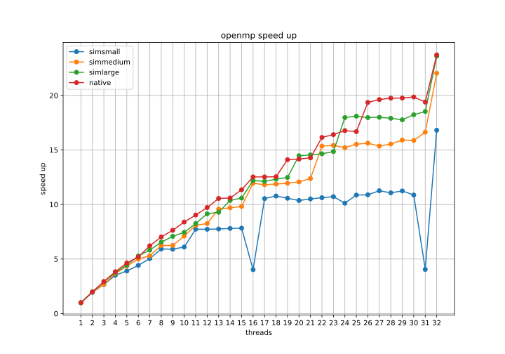

<!-- START doctoc generated TOC please keep comment here to allow auto update -->
<!-- DON'T EDIT THIS SECTION, INSTEAD RE-RUN doctoc TO UPDATE -->
**Table of Contents**  *generated with [DocToc](https://github.com/thlorenz/doctoc)*

- [Analisando dados com pascalanalyzer](#analisando-dados-com-pascalanalyzer)
  - [pascalanalyzer](#pascalanalyzer)
  - [Mudança para o OpenMP](#mudança-para-o-openmp)
    - [Alterado o Makefile](#alterado-o-makefile)
    - [Adicionado novas linhas de código](#adicionado-novas-linhas-de-código)
  - [integração com parsec](#integração-com-parsec)
  - [Compilação e testes iniciais](#compilação-e-testes-iniciais)
    - [Limpando compilação antiga](#limpando-compilação-antiga)
    - [Compilando com pthreads](#compilando-com-pthreads)
    - [Compilando com OpenMP](#compilando-com-openmp)
    - [Testando compilações](#testando-compilações)
  - [Gerando o script run_parscal.sh](#gerando-o-script-run_parscalsh)
    - [run_parscal.sh  informações da vídeo aula](#run_parscalsh--informações-da-vídeo-aula)
        - [o parâmetro **-c (core)**](#o-parâmetro--c-core)
        - [o parâmetro **-i (inputs)**](#o-parâmetro--i-inputs)
    - [Número de threads, propriedades fora da vídeo aula](#número-de-threads-propriedades-fora-da-vídeo-aula)
  - [teste na minha máquina](#teste-na-minha-máquina)
  - [Resultados](#resultados)
    - [Gráficos Pthreads](#gráficos-pthreads)
      - [Speed up](#speed-up)
      - [Efficiency](#efficiency)
      - [time](#time)
    - [Gráficos OpenMP](#gráficos-openmp)
      - [Speed up](#speed-up-1)
      - [Efficiency](#efficiency-1)
      - [time](#time-1)
  - [Referências](#referências)

<!-- END doctoc generated TOC please keep comment here to allow auto update -->

# Analisando dados com pascalanalyzer


## pascalanalyzer

baixei o pascalanalyzer no repositório https://gitlab.com/lappsufrn/pascal-releases e coloquei na sub pasta pascal-releases.
Adicionei no .**gitignore** essa pasta, pois não sei quando a licença do software em ter uma copia nesse repositório.   

## Mudança para o OpenMP

### Alterado o Makefile
Para mudar para o OpenMP, primeiramente foi configurado o Makefile adicionando
uma nova versão que compila utilizando o OpenMP. Foi adicionado um Define para o
OpenMP o **OPENMP_VERSION**, dessa forma podemos adicionar a nova feature sem alterar o código existente. Também foi adicionado
uma flag **ENABLE_PTHREADS** para desativar o lib **pthreads** sem
precisar remover linas de código.


```Makefile
ifdef version
# nova versão adicionada
  ifeq  "$(version)" "openmp" 
	DEF := $(DEF) -DENABLE_THREADS -DOPENMP_VERSION
	CXXFLAGS := $(CXXFLAGS) -fopenmp
  endif

  ifeq "$(version)" "pthreads" 
    DEF := $(DEF) -DENABLE_THREADS -DENABLE_PTHREADS
    CXXFLAGS := $(CXXFLAGS) -pthread
  endif
  ifeq "$(version)" "tbb"
    DEF := $(DEF) -DENABLE_THREADS -DTBB_VERSION
    LIBS := $(LIBS) -ltbb
  endif
endif
```

### Adicionado novas linhas de código
No arquivo [HJM_Securities.cpp](../pkgs/apps/swaptions/src/HJM_Securities.cpp)
Com o define **OPENMP_VERSION**, foi incluído a lib **#include \<omp.h\>** e com o define  **ENABLE_PTHREADS**, foi removido
o **#include \<pthread.h\>**

```c++
#ifdef ENABLE_PTHREADS
#include <pthread.h>
#endif // ENABLE_PTHREADS

#define MAX_THREAD 1024

#ifdef OPENMP_VERSION

#include <omp.h>

#endif // OPENMP_VERSION
...
```
Na versão pthreads observamos que nos laços for utilizados,
a lib pthreads chama a função **worker** com o parâmetro sendo a referência do **threadIDs[i]**. 

```c++
#ifdef ENABLE_PTHREADS
  printf("Pthreads is enabled !!\n");
  int threadIDs[nThreads];
  for (i = 0; i < nThreads; i++)
  {
    threadIDs[i] = i;
    pthread_create(&threads[i], &pthread_custom_attr, worker, &threadIDs[i]);
  }
  for (i = 0; i < nThreads; i++)
  {
    pthread_join(threads[i], NULL);
  }

  free(threads);

#endif // ENABLE_PTHREADS
```
por tanto, para usarmos o OpenMP, foi utilizado o pragma omp
sendo que é passado para ele o número threads que deve ser utilizado: num_threads(nThreads), sendo nThreads um parâmetro
que passado por linha de comando.

```c++
#ifdef OPENMP_VERSION
   printf("OpenMP is enabled !!\n");
  #pragma omp parallel for num_threads(nThreads) 
  for (i = 0; i < nThreads; i++)
  {
    int thread_id =  omp_get_thread_num();
    printf("Call worked on thread id: %i\n",thread_id);// test
    worker(&thread_id);
  }

#endif // OPENMP_VERSION

```


## integração com parsec

Por fim a aplicação é integrada com o **parsec** criando o arquivo de configuração chamado [gcc-openmp.bldconf](.../../../pkgs/apps/swaptions/parsec/gcc-openmp.bldconf)
nele é passado as configurações de compilação que informa
ao Makefile que a versão utilizada nessa compilação é o openmp.
```shell
...
# Environment to use for configure script and Makefile
build_env="version=openmp"# modificação 
```
Basicamente esse arquivo é uma copia do arquivo de configuração do
[gcc-pthreads.bldconf](.../../../pkgs/apps/swaptions/parsec/gcc-pthreads.bldconf), mudando o valor da variável version
para **openmp**

## Compilação e testes iniciais

### Limpando compilação antiga

```bash
parsecmgmt -a fullclean -p all
parsecmgmt -a uninstall -p all
```

### Compilando com pthreads
compilei com o swaptions com pthreads

```bash
parsecmgmt -a build -p swaptions # sabendo que a compilação padrÃo é com pthreads
```

### Compilando com OpenMP

Sabendo que o porte para OpenMP está configurado com o parsec, então para a compilação do projeto usando OpenMP é usando a linha de comando:

```bash
parsecmgmt -a build -c gcc-openmp -p swaptions
```

Para execução de do projeto usando o openmp, é necessário passar o
parâmetro **-c gcc-openmp**, um exemplo de comando seria assim:

### Testando compilações

```bash
parsecmgmt -a run -p swaptions -i simsmall -c gcc-openmp -n 8
```
no exemplo a cima o swaptions é executado usando o os dados de entrada simsmall e passando o número de threads igual a 8, **-n 8**.

Também é testado a compilação com pthreads:
```bash
parsecmgmt -a run -p swaptions -i simsmall -n 8
```

tendo os dois executáveis tanto com o pthreads quando OpenMP, foi copiado os dois
executáveis para essa pasta **pascal** e renomeado os executáveis com **swaptions-pthreads**  e **swaptions-openmp**, ambos executáveis serão utilizados
para a criação de um script.


## Gerando o script run_parscal.sh

A compilação gera um arquivo executável chamado __swaptions__ na pasta __inst__.
Copiei o arquivo __swaptions__ e analizei os arquivos:

- [simsmall.runconf](../pkgs/apps/swaptions/parsec/simsmall.runconf)

- [simmedium.runconf](../pkgs/apps/swaptions/parsec/simmedium.runconf)

- [simlarge.runconf](../pkgs/apps/swaptions/parsec/simlarge.runconf)

- [native.runconf](../pkgs/apps/swaptions/parsec/native.runconf)

criando a primeira parte do shell script [run_parscal.sh](run_parscal.sh).

```sh
# simsmall
simsmall="-ns 32 -sm 10000 -nt ${NTHREADS}"

# simmedium
simmedium="-ns 64 -sm 20000 -nt ${NTHREADS}"

#simlarge
simlarge="-ns 96 -sm 40000 -nt ${NTHREADS}"

#native
native="-ns 128 -sm 1000000 -nt ${NTHREADS}"
```
Nó entanto sabendo que o número máximo de threads que teremos que testar é 32 e o número de simulações tem que ser maior ou igual ao número  de threads, colocamos a menor simulação (**simsmall**) sendo sendo 32 e fomos somando em 32, ou seja: 32, 64,96,128. 

### run_parscal.sh  informações da vídeo aula

Assistindo a vídeo aula, entendi que :

##### o parâmetro **-c (core)**
especifica em qual core a aplicação sera executada, no nosso caso
quero que a aplicação utilize todos os cores ou threads da minha máquina.

##### o parâmetro **-i (inputs)**
**-i INPUTS** ou **--ipts INPUTS** especifica os argumentos de entrada da aplicação swaptions, por tanto concatenei todas as entradas: simsmall, simmedium, simlarge, native no parâmetro
**--ipts**, sendo que como tenho  8 threads, em todos os parâmetros (simsmall, simmedium, simlarge, native)


### Número de threads, propriedades fora da vídeo aula

Sabendo que internamente o **pascalanalyzer**, substitui o parâmetro \_\_nt\_\_ pelo números de threads a ser passado
para a aplicação então:

```bash
# Execute esse script depois de instanciar o pascalanalizer

NTHREADS="__nt__" 
# segundo frankson, tenho que passar esse parâmetro  __nt__
# para os cores.
....

....
# tenho 8 threads, portanto
MY_CORES=8;

pascalanalyzer -c 1:$MY_CORES --ipts "$simsmall,$simmedium,$simlarge,$native" "./swaptions" -o "swaptions.json"
```
Dessa forma, a cada execução do swaptions, o pascalanalyzer vai subsistir, o  \_\_nt\_\_ pelo número de threads a ser analisado,
exemplo:

```bash
pascalanalyzer -c 1:$MY_CORES --ipts "$simsmall,$simmedium,$simlarge,$native" "./swaptions" -o "swaptions.json"
# na interação 1:1 (1 core, simsmall) vira

./swaptions -ns 32 -sm 10000 -nt "__nt__"
# se transforma em
./swaptions -ns 32 -sm 10000 -nt 1

# na interação 1:2 (1 core, simmedium) vira
./swaptions -ns 64 -sm 20000 -nt "__nt__"
# se transforma em
./swaptions -ns 64 -sm 20000 -nt 1

# na interação 1:3 (1 core, simlarge) vira
./swaptions -ns 96 -sm 40000 -nt "__nt__"
# se transforma em
./swaptions -ns 96 -sm 40000 -nt 1
```
e assim vai até a aplicação ser executada
com entre 1 até 32 cores, caso executado no super computador
ou entre 1 até 8 cores, caso rodado na minha máquina.

## teste na minha máquina
Sabendo que temos que testar tanto com pthreads quando
quando openmp, no final  do script [run_parscal.sh](run_parscal.sh), são executados 2 vezes o pascalanalyzer:

```bash
pascalanalyzer -c 1:$MY_CORES --ipts "$simsmall,$simmedium,$simlarge,$native" "./swaptions-pthreads" -o "swaptions-pthreads.json"
pascalanalyzer -c 1:$MY_CORES --ipts "$simsmall,$simmedium,$simlarge,$native" "./swaptions-openmp" -o "swaptions-openmp.json"
``` 
O primeiro é analizado o pthreads e segundo é analizado o openmp. 

Apos criar o script [run_parscal.sh](run_parscal.sh), fui na
pasta **pascal-releases**, e adicionei o pascalanalyzer no meu ambiente:

```bash
source pascal-releases/env.sh 
```

e executei o script

```bash
# adicionar permissão de execução
chmod +x ./run_parscal.sh
./run_parscal.sh # pode ir tomar um ☕
```

gerando os arquivos [swaptions-pthreads.json](swaptions-pthreads.json) e [swaptions-openmp.json](swaptions-openmp.json)

## Resultados
Para visualizar os gráficos foi criado um um plotter, que realiza um parser nos arquivos json
e sava gráficos relacionados ao tempo de execução, speed up e eficiência.
Onde o speed up $S = \frac{T_{serial}}{T_{parallel}}$  
e eficiência $E = \frac{S}{p}$, onde $p$ é número de threads.

### Gráficos Pthreads 

#### Speed up


#### Efficiency


#### time 


### Gráficos OpenMP

#### Speed up


#### Efficiency


#### time 


## Referências
https://ppc.cs.aalto.fi/ch2/openmp/